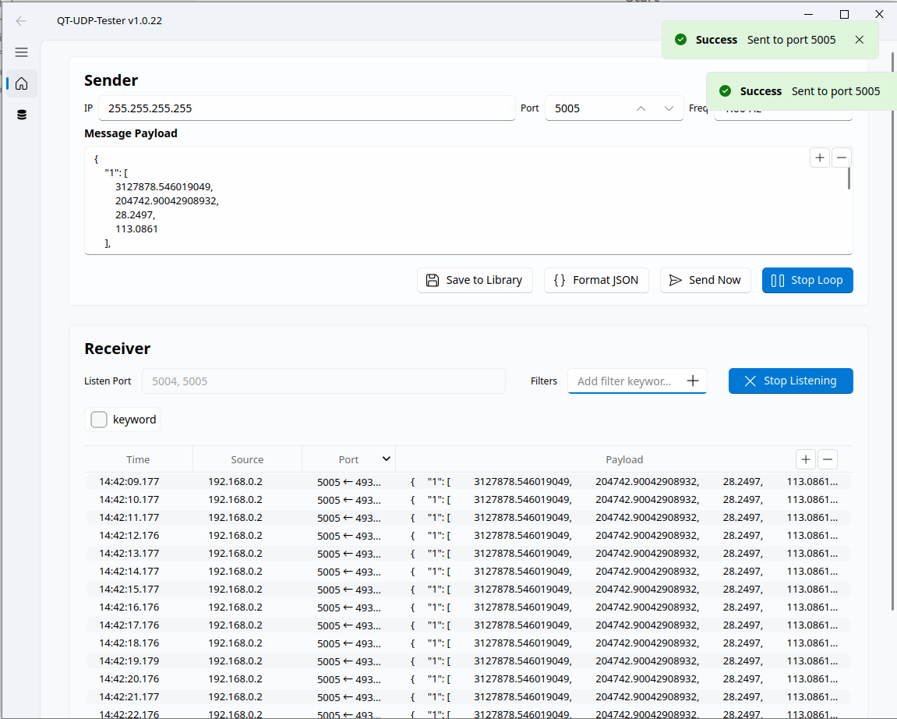
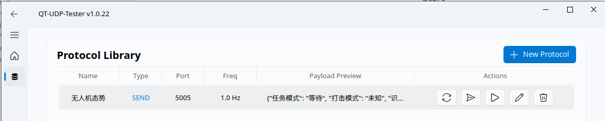
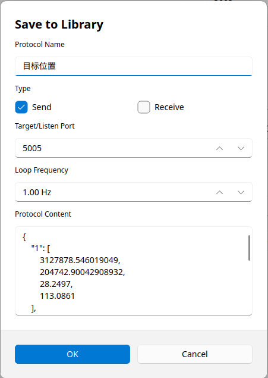

# QT-UDP-Tester

一个基于 PyQt5 和 Fluent Design 设计的高性能 UDP 调试与协议测试工具。

[**English Version (英文版)**](../README.md)



## 🚀 核心功能

### 1. 协议管理与持久化
* **数据库驱动**：使用 SQLite 本地数据库存储协议配置，支持海量协议快速检索。

* **灵活配置**：支持为每个协议独立配置名称、目标/监听端口、发送负载及循环频率（0.01Hz - 1000Hz）。
* **分类隔离**：区分“发送”与“接收”类型，简化复杂测试场景下的操作流程。

### 2. 高性能通信引擎
* **异步并发处理**：基于 `select` 多路复用与多线程技术，确保在高频报文冲击下 UI 依然流畅。
* **数据批处理**：内置报文缓冲区，通过智能合并刷新机制平衡实时性与系统开销。
* **精准定时控制**：高精度定时器确保循环发送任务的间隔误差降至最低。

### 3. 现代化交互体验
* **Fluent Design 视觉**：完美适配 Windows 11 视觉风格，支持深色/浅色主题。
* **实时报文监控**：结构化展示报文来源、时间戳（微秒级）、本地端口及原始内容。
* **动态视图调节**：
    * **字体缩放**：表格与日志区支持实时 `Add/Remove` 缩放，优化长时观测疲劳。
    * **弹性布局**：内置视图比例调节器，可自由分配监控区与配置区的显示空间。
* **智能过滤**：支持通过标签（Tags）对接收到的数据流进行多维度实时筛选。

## 🛠️ 安装要求

* **Python**: 3.8 或更高版本
* **系统环境**: Windows / Linux / macOS

### 安装依赖
```bash
pip install -r requirements.txt
```

## 📖 使用指南

1. **运行程序**：
   ```bash
   python udp_tool_gui.py
   ```
2. **定义协议**：点击“添加”按钮，在弹出的 Fluent 风格对话框中输入协议参数。

3. **数据交互**：
   - 配置为 `Send` 的协议可手动触发或开启循环自动发送。
   - 配置为 `Receive` 的协议将自动开启本地端口监听。
4. **视图调整**：使用监控表右上角的缩放按钮调整显示字体；拖动中间的分隔栏调整视图占比。


## 📂 项目结构
* `udp_tool_gui.py`: 程序主逻辑与 GUI 实现。
* `icons/`: 界面资源文件。
* `requirements.txt`: 依赖清单。
* `~/.qt-udp-tester/`: 配置文件与协议数据库默认存储路径。

---
*Professional, Fast, and Fluent.*
